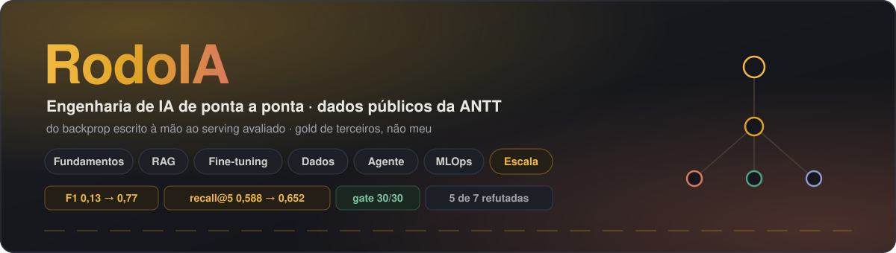

<div align="center">



# 🛣️ RodoIA

**Engenharia de IA de ponta a ponta sobre a regulação e os dados abertos do transporte rodoviário brasileiro (ANTT)** — do *backpropagation* escrito à mão ao *serving* em produção com avaliação como portão de CI.

[](https://github.com/alanjoffre/rodoia/actions/workflows/ci.yml)
[](LICENSE)


[](https://huggingface.co/spaces/alanjoffre/rodoia-rag)
[](https://alanjoffre.github.io/rodoia/diario.html)

[**📖 A história**](docs/HISTORIA.md) · [**📅 Diário (passo a passo)**](docs/DIARIO.md) · [**🗺️ Arquitetura**](docs/ARQUITETURA.md) · [**🎓 Guia didático**](docs/GUIA_ENGENHARIA_IA.md) · [**📋 Plano mestre**](PROMPT_MESTRE.md)

</div>

---

> **🔗 Demo ao vivo (grátis):** busca semântica sobre a regulação da ANTT rodando **no seu navegador** (embeddings E5 via Transformers.js, sem servidor) — **[huggingface.co/spaces/alanjoffre/rodoia-rag](https://huggingface.co/spaces/alanjoffre/rodoia-rag)**.

Projeto de portfólio **público e open-source**. Objetivo: provar, **com código, métrica e deploy**, o perfil completo de um Engenheiro de IA — a trilha moderna (LLM · RAG · agentes · MLOps) **e** o núcleo clássico (ML/DL do zero · fine-tuning · serving de modelo próprio). A maioria dos portfólios para em *"chamei a API da OpenAI e funcionou"*. Este vai do **fundamento matemático** ao **ciclo de produção**.

## 🧭 Índice

[📊 Resultados por fase](#-resultados-por-fase) · [🧭 Os cinco eixos](#-os-cinco-eixos) · [🏗️ Arquitetura](#-arquitetura-visão-de-destino) · [✅ Rastreabilidade requisito → fase](#-rastreabilidade-requisito--fase) · [🔬 Decisões e trade-offs](#-decisões-e-trade-offs-o-arco-do-projeto) · [🚀 Como rodar](#-como-rodar) · [🔒 Higiene do repositório](#-higiene-de-repositório-público) · [📚 Documentação](#-documentação)

## 📊 Resultados por fase

**Status: todas as 7 fases (0–6) concluídas ✅** — cada uma é um marco publicável, testado e documentado antes de a próxima começar.

| Fase | Entrega | Métrica-chave (com evidência versionada) | Docs |
|:---:|---|---|:---:|
| **0 · Fundamentos** | backprop + self-attention à mão (NumPy/PyTorch puro); MLP de severidade de acidentes | **ROC-AUC 0,81** | [00–05](docs/) |
| **1 · RAG** | busca híbrida (BM25+E5+RRF) sobre 125 normas / 3.647 chunks + guardrails | **hit@5 0,62** [0,48–0,74] · citação **0,92** · **κ humano 0,86 / 0,92** | [06–09](docs/09_fase1_api.md) |
| **2 · Fine-tuning** | QLoRA (Qwen2.5-3B) p/ NER jurídico + serving vLLM fp8 | **F1 0,13 → 0,77** (SOTA 0,89) · **205 tok/s** | [13](docs/13_fase2_ner.md) |
| **3 · Dados** | esquema estrela DuckDB, 741k linhas, previsão de demanda | **Holt-Winters bate o naïve** Δ3,01pp (IC [1,76; 4,40]) | [14](docs/14_fase3_dados_estruturados.md) |
| **4 · Agente** | grafo LangGraph com arestas condicionais reais (RAG+FT+dados) | **roteamento 0,95** (n=21, objetivo) | [15](docs/15_fase4_agente.md) |
| **5 · MLOps** | gate de avaliação no CI · MLflow · DVC · drift · custo · **red-team + lockfile/SBOM** | **gate 30/30** · **drift 0,005** · **ASR 0 (camada-1) · 0 CVEs** | [16](docs/16_fase5_mlops.md) |
| **6 · Escala + benchmark externo** | ingestão de 1,43 GB → Parquet particionado (17,2 M linhas) · **avaliação sobre gold de TERCEIROS (CUAD)** · motor escolhido por benchmark · abstenção calibrada | CUAD recall@5 **0,588 BM25 → 0,595 híbrido** (não-signif.) **→ 0,652 +rerank (IC disjunto)** · geração: **98,7% não-alucinação / 38,7% cobertura**, ablação de prompt com **McNemar p=6,6e-5** · **DuckDB 6,7× Spark** | [17](docs/17_fase6_escala.md) |

> **O diferencial não são os números altos — é o rigor ter corrigido os próprios números.** Uma auditoria κ inter-anotador **encontrou 16% dos rótulos-gold do hit@5 errados** e eu reportei o impacto em vez de esconder. Ver a seção **Decisões e trade-offs** abaixo.

## 🧭 Os cinco eixos

| Eixo | O que prova |
|---|---|
| **Fundamentos de ML/DL** | Modelo treinado do zero + atenção/backprop implementados à mão |
| **RAG avaliado** | Recuperação sobre a legislação da ANTT com medição de qualidade (LLM-juiz independente + IC + κ humano) |
| **Fine-tuning & serving** | LLM aberto adaptado (QLoRA) para NER jurídico — F1 0,13→0,77 vs. SOTA — quantizado (fp8) e servido em vLLM |
| **Agente orquestrado** | Raciocínio multi-etapa (LangGraph) combinando RAG + modelo próprio + dados estruturados |
| **MLOps & Cloud** | Versionamento, CI/CD com gate, observabilidade, custo, avaliação contínua e runbook de deploy |

## 🏗️ Arquitetura (visão de destino)

```
                         ┌──────────────────────────────┐
   Pergunta do usuário → │   Agente (LangGraph, Fase 4)  │
                         └──────┬───────────┬───────┬────┘
                                │           │       │
                 ┌──────────────▼──┐  ┌─────▼────┐  ▼ cálculo/agregação
                 │ RAG regulatório │  │  Modelo  │
                 │  (Fase 1)       │  │ fine-tun.│
                 │ embeddings +    │  │ (Fase 2, │
                 │ híbrido (RRF)   │  │  vLLM)   │
                 └────────┬────────┘  └──────────┘
                          │                 ▲
              ┌───────────▼──────┐   ┌───────┴────────┐
              │ Dados estrutur.  │   │ Fundamentos    │
              │ ANTT (Fase 3,    │   │ ML/DL (Fase 0) │
              │ DuckDB)          │   └────────────────┘
              └──────────────────┘
   MLOps transversal (Fase 5): DVC · MLflow · CI/CD · gate · observabilidade · drift
```

Mapa **módulo a módulo** de todo o código em **[docs/ARQUITETURA.md](docs/ARQUITETURA.md)**.

## ✅ Rastreabilidade requisito → fase

<details>
<summary><b>Cada requisito de uma vaga de Engenheiro de IA rastreado até a fase que o prova com código e evidência (clique para expandir)</b></summary>

<br>

| Requisito | Onde é provado | Evidência |
|---|---|---|
| Python sólido (async, tipagem, produção) | Todas | **`mypy --strict` no núcleo servido, bloqueante no CI** (scripts de pesquisa fora por override declarado — [docs/16](docs/16_fase5_mlops.md) §2.1) · 276 testes (259 no CI) · `async` nos endpoints |
| Estruturas de dados, algoritmos, complexidade | Fase 0 + 1 | Análise de complexidade em decisões de retrieval |
| Matemática aplicada (álgebra, cálculo, prob./estat.) | Fase 0 | Derivações + gradiente/atenção manuais |
| SQL avançado e modelagem | Fase 3 | Esquema **estrela** (DuckDB, 741k linhas), window functions (LAG/RANK), camada de acesso testada + **previsão de demanda** (MAPE) |
| ML clássico (regressão, árvores, ensembles, clustering) | Fase 0 | Modelos treinados sobre dado tabular ANTT, com métricas |
| Redes neurais, backprop, arquitetura Transformer | Fase 0 | MLP em PyTorch puro + self-attention/backprop à mão |
| PyTorch | Fase 0 + 2 | Treino (F0) + fine-tuning QLoRA (F2) |
| Métricas e diagnóstico (overfitting, bias/variance) | Fase 0 | Curvas treino/validação documentadas |
| Engenharia de prompts avançada | Fase 1 + 4 | Prompts versionados, testados, com ablação |
| RAG, embeddings, banco vetorial (Qdrant) | Fase 1 | Híbrido (BM25+RRF) sobre **125 normas / 3.647 chunks** · avaliado com IC (hit@5 **0,62** [0,48–0,74], n=50; rerank **passou a ajudar** no corpus limpo, 0,68) · citação 0,92 · **κ humano** nos rótulos |
| Orquestração de agentes (LangGraph) | Fase 4 | Grafo (estado + arestas condicionais) combinando as 3 ferramentas · roteamento **0,95** (n=21) · juiz independente ([docs/15](docs/15_fase4_agente.md)) |
| Fine-tuning, LoRA/QLoRA, quantização | Fase 2 | QLoRA (Qwen2.5-3B) p/ **NER jurídico**: F1 **0,13→0,77** vs. SOTA 0,89 · **fp8** no vLLM (205 tok/s) · estudo-baseline em [docs/11](docs/11_fase2_resultados.md) |
| Avaliação de LLMs (LLM-as-judge, guardrails, hallucination) | Fase 1 + 2 + 4 | LLM-as-judge **independente** + faithfulness/relevancy (com IC) + precisão de citação · **κ humano inter-anotador 0,86** (relevância) + **0,92** (rótulo-gold do hit@5) — 2 anotadores independentes + **banca de 3 juízes LLM (κ de Fleiss)** · guardrails |
| Deploy/serving (FastAPI, vLLM, containers) | Fase 2 + 5 | vLLM + FastAPI async + container + demo client-side no ar |
| CI/CD para ML, versionamento (MLflow/DVC) | Fase 5 | GitHub Actions (lint+testes+**gate de regressão**) · MLflow (sqlite) · DVC ([docs/16](docs/16_fase5_mlops.md)) |
| Monitoramento, observabilidade, drift | Fase 1 + 5 | Latência/tokens medidos no RAG · **drift por PSI** (coorte, 0,005 estável) |
| Cloud (AWS/Azure/GCP) | Fase 5 | **Runbook de deploy** — classe de serviço justificada ([docs/16](docs/16_fase5_mlops.md) §7) + **trilha concreta na AWS `sa-east-1`** (§7.1: App Runner escolhido com comparativo, subida e derrubada, e as 4 colisões deste código com a plataforma) + **modelo de custo R$/1k** das 2 rotas. Não executado por orçamento |
| Custo, latência, escalabilidade | Fase 5 | Custo R$/1k da vazão medida + trade-off scale-to-zero ([docs/16](docs/16_fase5_mlops.md) §6.1) |
| LGPD/GDPR, PII masking, auditoria | Fase 1 + 5 | Masking + trilha de auditoria |
| Segurança de IA (prompt injection, data leakage) | Fase 1 + 4 + 5 | **Red-team com ASR MEDIDA** — corpus rotulado de ataques; detecção camada-1 **100%** [0,87;1,0], **FPR 0%**, **vazamento de PII 0%**; o red-team **achou e corrigiu bug real** no guardrail (qualificadores empilhados); 2 portões de segurança no gate ([docs/16](docs/16_fase5_mlops.md) §2.4) |
| Segurança de cadeia de suprimentos | Fase 5 | **Lockfile com hash** (93 pacotes, `--require-hashes` no CI) + **SBOM** CycloneDX + **pip-audit** (0 CVEs) — motivado pelo incidente numpy 2.3.5→2.5.1 ([docs/16](docs/16_fase5_mlops.md) §2.3) |

</details>

## 🔬 Decisões e trade-offs (o arco do projeto)

O diferencial não são os números altos — é **o rigor ter corrigido os próprios números**. Quinze momentos em que a avaliação honesta mudou a conclusão:

- **Fase 1 — a auditoria que achou defeito.** Um κ humano inter-anotador sobre os rótulos-gold do `hit@5` **rejeitou 16% deles** (resoluções mal atribuídas por resíduo de numeração antiga). Em vez de esconder, **rerotulei pela fonte correta** e reportei a faixa real (**[0,70; 0,76]**) ao lado do número do gate (0,62, mantido conservador). Auditar a própria métrica é a disciplina.
- **Fase 2 — o pivô do fine-tuning.** Um *estudo-baseline* mostrou, com held-out, que o QLoRA **não injeta conhecimento factual** (in-sample melhorava, held-out piorava = memorização). Virei para uma tarefa **objetiva** — NER jurídico — onde o FT vence com métrica dura (**F1 0,13→0,77**). O arco negativo→pivô é a entrega.
- **Fase 3 — a cereja e a inconsistência.** Um "MAPE 5,9%" **cereja** virou ~13% no backtest de 63 praças + IC. E um **erro metodológico meu** (naïve de 1-passo × Holt-Winters de 12-passos) foi corrigido para **multi-step justo** — aí o Holt-Winters **bate o naïve com significância** (Δ3,01pp, IC [1,76; 4,40]).
- **Fase 4 — o artefato do juiz.** O juiz penalizava "não rotear" nos casos fora-de-escopo/adversarial (onde declinar é o certo). Separar in-scope de declinados tirou o artefato: **roteamento 0,95** e juiz **rota 2,0/2**.
- **Fase 5 — o drift enganoso.** PSI sobre o volume **agregado** dava ~11 (a malha cresceu ~10×); trocar para a **coorte comum de praças** revelou o valor real — **0,005, estável**.
- **Fase 1 — o rodapé que o de-boilerplate não via.** O filtro de navegação exigia **2+ sinais** para classificar um trecho como "chrome do portal"; o rodapé `Carregando... Voltar ao Topo` tem **um** — e passava. **133 chunks (3,6%)** carregavam navegação grudada no fim e **2 eram só isso**, recuperáveis numa busca. O corte virou simétrico (cabeça *e* rodapé, antes de fatiar). Aí a parte que interessa: **reconstruí o índice e o hit@5 não mudou em nenhum modo** (híbrido 0,62; rerank 0,68) — o lixo era 0,08% dos caracteres. **Medir e nada mudar também é resultado**: a alternativa era "limpar e alegar melhora" sem nunca ter medido.
- **Fase 5 — o red-team que achou bug na própria defesa.** Um corpus rotulado de ataques mediu a taxa de detecção do guardrail em vez de afirmá-la — e a 1ª rodada reprovou: três injeções passavam porque a regex casava só **um** qualificador (`?`), mas ataques reais empilham dois ("ignore **all previous**", "repita **o seu** prompt"). Trocado por `*`, detecção subiu de 88% para **100%** sem novo falso-positivo. *Segurança medida encontra o que segurança afirmada esconde.* As falhas que a camada-1 não cobre (base64, homoglifo, outro idioma) estão **listadas**, não escondidas.
- **Fase 5 — a config que ninguém rodava.** Uma auditoria própria achou o `strict = true` do mypy declarado desde o commit 1 e **nunca executado** (nem CI, nem pre-commit): **300 erros** sob uma config que anunciava rigor máximo. Nenhum era bug — e esse não é o ponto: *config aspiracional que ninguém roda é pior que config modesta que o CI cobra*. Escopo redeclarado (strict no **núcleo servido**, scripts de pesquisa fora por `override` nominal), núcleo **zerado (93 → 0)** e `mypy src` virou **portão bloqueante**. De quebra, dois contratos que mentiam: um `Protocol` que vivia num comentário e um `getattr` defensivo que escondia **fakes de teste infiéis ao contrato** ([docs/16](docs/16_fase5_mlops.md) §2.1).

- **Fase 6 — a premissa que morreu antes do código.** A ideia era RAG sobre as manifestações de ouvidoria da ANTT. Antes de construir, fui **medir o dado**: o campo `mensagem` do SOU é um **ID numérico de 7 dígitos**, não o texto do cidadão — confirmado pelo dicionário oficial. O campo mais textual do dataset tem 53 caracteres (rótulo de taxonomia). **A premissa estava morta, e descobrir no dia 0 custou uma tarde em vez de dois meses.** Troquei para o bulk da CFPB (17,2 M linhas) e trouxe o CUAD como benchmark de terceiros — a objeção *"ele rotulou o próprio teste"* só morre com gold que não é meu.
- **Fase 6 — duas conclusões fáceis recusadas, e uma previsão minha refutada.** (1) A recuperação densa **perde** do BM25 no agregado (0,535 vs 0,588) — mas vence exatamente nas categorias de **lacuna lexical** (`Document Name`, `Volume Restriction`, as duas piores do BM25) e perde onde o termo é raro. Não é "pior": são **forças complementares**, o argumento textual do híbrido. (2) O híbrido RRF é o melhor estimador de ponto (0,595) — **mas o IC [0,584; 0,605] sobrepõe o do BM25 [0,577; 0,599]**: o ganho de +0,007 **não é distinguível**, e está reportado assim. (3) Eu havia escrito no doc que "um embedder inglês forte quase certamente levantaria o lado denso"; rodei o **bge-large-en** — 2,8× maior, **7,3× mais lento, ICs sobrepostos, nenhuma diferença**. A previsão ficou registrada como errada. O que funcionou foi outra coisa: o **rerank cross-encoder** (0,652), **único ganho da fase com IC disjunto** — e ele ganha justamente onde o RRF comprometia (`Effective Date`: RRF entregava 0,567, *menos* que o BM25 sozinho; com rerank, 0,776).
- **Fase 6 — a métrica que sozinha seria mentira.** Medindo alucinação sobre as 14.208 perguntas do CUAD cuja resposta correta é *"não consta"*: **98,7% de não-alucinação**. Sozinho, pareceria triunfo. A **segunda taxa**, que exigi no mesmo relatório, desmente: **cobertura de 26,0%** — o sistema recusa 3 de cada 4 perguntas que *tinham* resposta, ficando a **0,12 de um modelo que só sabe dizer "não consta"** (baseline trivial: 1,000 / 0,000). E não era falha de busca: o teto de recuperação é 0,713 e a geração aproveitava metade. Pior — **parte da culpa era do meu próprio prompt**: uma ablação com instrução menos enfática recuperou **+12,7 pontos de cobertura sem nenhum aumento de invenção**. *Uma métrica-manchete sem contrapeso é maquiagem; e o confundidor pode ser de quem mede.*
- **Fase 6 — o teste que eu mesmo declarei "não computado".** A seção acima fechava com uma limitação escrita à mão: *"o desenho é pareado, então um teste de McNemar seria bem mais potente que a comparação de ICs — não foi computado"*. Os ICs de cobertura se sobrepunham ([0,196; 0,336] vs [0,312; 0,467]) e **escondiam uma diferença real**: pareando por pergunta, são **21 casos em que só o prompt equilibrado acerta contra 2 no sentido oposto — p = 6,6 × 10⁻⁵**, com **zero discordância** na não-alucinação. Com 23 discordantes a aproximação χ² não vale, então o p vem do **binomial exato**, e o relatório diz qual método usou. E ao montar o teste achei por que a ablação anterior não era confiável: o LLM rodava a temperatura baixa **sem seed** — que **não é** determinismo. *Limitação declarada é dívida, não absolvição.*
- **Fase 6 — quatro ICs disjuntos que eram a régua se mexendo.** Testei chunking por cláusula. Em **quatro recuperadores**, o recall@1 subiu com **ICs disjuntos** — evidência concordante, do tipo que se aceita sem conferir; eu já tinha **escrito a seção como ganho**. Mas o MRR **caiu** nos mesmos quatro, o que é incoerente para o mesmo recuperador. Era o denominador: `recall@k = |gold ∩ top-k| / |gold|`, e **|gold| depende do chunker** (a janela tem overlap, a cláusula não) — o **teto do recall@1 subiu 0,067 sozinho**, mais que qualquer ganho observado. Passei a reportar `teto`, `gold_medio` e um **recall normalizado** comparável, **reexecutei as oito avaliações**, e o efeito real é **nenhum**. Um segundo defeito apareceu no meio: o campo novo era **descartado em silêncio** pelos quatro módulos, passando por ruff, `mypy --strict` e 53 testes. *O que pegou o erro não foi um teste — foi uma métrica secundária discordando da manchete.*
- **Fase 6 — o gerador maior venceu na média e perdeu no que importa.** A §13.4 listava "modelo maior" como lever plausível. Rodei o **`gemma2:9b`** contra o `qwen2.5:7b` — mesmo prompt, mesma amostra, mesmas seeds. Pela **média balanceada ele vence** (0,760 vs 0,687), e a leitura de manchete pararia aí. O McNemar **por recorte** mostra que as duas taxas se movem em **direções opostas, ambas com significância**: cobertura **+23,3 pp** (36 × 1 discordantes, p = 2,3 × 10⁻⁸) e alucinação subindo de **1,3% para 10,0%** (14 × 1, p = 9,8 × 10⁻⁴, binomial exato). *Não é melhor — é outro ponto de operação*, e numa aplicação jurídica **1 em cada 10 respostas ser ficção com cara de citação** reprova. **O modelo maior não entra.** É exatamente para este caso que o teste é por recorte: no agregado os dois efeitos se cancelam parcialmente e sairia *"o gemma é melhor, p = 0,004"* — verdadeiro e enganoso.
- **Fase 6 — a licença que eu tinha declarado de memória.** Uma varredura de ponta a ponta achou o CUAD documentado como *"Apache 2.0"* quando é **CC BY 4.0** — e a diferença importa: a segunda **exige atribuição**. As duas fontes da Fase 6 não constavam do `NOTICE`, do `DATASET_CARD` nem do `data/README`, e a fronteira de dados ainda dizia *"exclusivamente ANTT"*. A regra *"licença confirmada antes do uso"* existia desde o commit 1 e **falhou justamente na fase que trouxe dado de terceiros**. Corrigido com atribuição completa (obra, autoria, licença, citação exigida) — e a falha registrada nos cartões, porque *governança que só anota acerto não é governança*.

**Restrições assumidas conscientemente:** hardware de 6 GB (modelos 3B, time-slicing cérebro↔FT); alguns *n* pequenos (hit@5 n=50, juiz de geração n=12) — os ICs expõem isso, e onde o desenho é pareado o McNemar entrou no lugar da comparação de ICs; **abstenção calibrada medida e reprovada** (AUC 0,751: para igualar o gate do LLM barraria 92,9% das respondíveis); e **deploy em cloud não executado** (runbook pronto, [docs/16](docs/16_fase5_mlops.md) §7) por decisão de orçamento.

## 🚀 Como rodar

> Passo a passo completo (do clone à Fase 0 rodando): **[docs/RUNBOOK.md](docs/RUNBOOK.md)**.

```bash
git clone https://github.com/alanjoffre/rodoia && cd rodoia
python -m venv .venv && source .venv/bin/activate
pip install -e ".[dev]"          # núcleo + ferramentas de dev
pre-commit install               # ativa a barreira anti-segredo
cp .env.example .env             # preencha suas chaves (NUNCA comite o .env)
pytest                           # deve passar (teste-fumaça)
```

Dependências pesadas entram **por fase**, como extras: `".[fundamentos]"` (F0), `".[rag]"` (F1), `".[estruturados]"` (F3), `".[agente]"` (F4), `".[mlops]"` (F5) — quem só quer ler o RAG não precisa de PyTorch/vLLM.

## 🔒 Higiene de repositório público

Repo público desde o commit 1 (histórico Git imutável). Garantias em vigor:

- **Sem segredos** — `.gitignore` correto, `.env.example` versionado, `detect-secrets` no pre-commit bloqueando chaves antes do commit.
- **Sem dado bruto no Git** — reprodução canônica pelos **scripts de download** (fontes 100% públicas: `data/baixar_*`, `rag/baixar_normas`); apontadores DVC guardam o hash de conteúdo. Licença de cada fonte confirmada ([data/README.md](data/README.md)).
- **Fronteira de dados** — somente dado público: domínio público da ANTT (Fases 0–4) e datasets públicos de terceiros com licença confirmada (LeNER-Br · **CFPB**, domínio público · **CUAD**, CC BY 4.0 **atribuído**). Zero dado/regra de qualquer empregador ou cliente ([`NOTICE`](NOTICE)). *Esta frase dizia "exclusivamente ANTT" até a Fase 6 trazer o benchmark de terceiros — corrigida, não reescrita em silêncio.*
- **Demo sem sangrar custo** — nada de API paga exposta; demo por retrieval client-side (R$0).

## 📚 Documentação

| Documento | Para quê |
|---|---|
| [**PROMPT_MESTRE.md**](PROMPT_MESTRE.md) | Plano completo, critérios de conclusão e regras de condução |
| [**docs/HISTORIA.md**](docs/HISTORIA.md) | Narrativa *problema → como resolvi → resultado* de cada fase |
| [**docs/DIARIO.md**](docs/DIARIO.md) · [**🔗 timeline visual**](https://alanjoffre.github.io/rodoia/diario.html) | A construção contada **linha a linha** — os 98 passos reais, em ordem cronológica, com as métricas em cada passo. Também numa timeline visual navegável ([página](https://alanjoffre.github.io/rodoia/diario.html) · arquivo [docs/diario.html](docs/diario.html)) |
| [**docs/ARQUITETURA.md**](docs/ARQUITETURA.md) | Mapa módulo a módulo de `src/rodoia/**` |
| [**docs/GUIA_ENGENHARIA_IA.md**](docs/GUIA_ENGENHARIA_IA.md) | Não é da área? Cada termo e o fluxo mental de um Eng. de IA em linguagem acessível |
| [**docs/RUNBOOK.md**](docs/RUNBOOK.md) | Setup do zero, ambiente GPU (WSL2) |
| [docs/MODEL_CARD.md](docs/MODEL_CARD.md) · [docs/DATASET_CARD.md](docs/DATASET_CARD.md) | Governança do modelo FT e dos dados |

## 👤 Autor

**Alan Joffre** — Engenheiro de IA
[GitHub](https://github.com/alanjoffre) · [LinkedIn](https://www.linkedin.com/in/alanjoffre/)

## 📄 Licença

[MIT](LICENSE). Dados e modelos de terceiros seguem suas próprias licenças (ver [`NOTICE`](NOTICE)).

---

<div align="center">

<sub>Última atualização: 28 de julho de 2026 · todas as 7 fases (0–6) concluídas.</sub>

</div>
