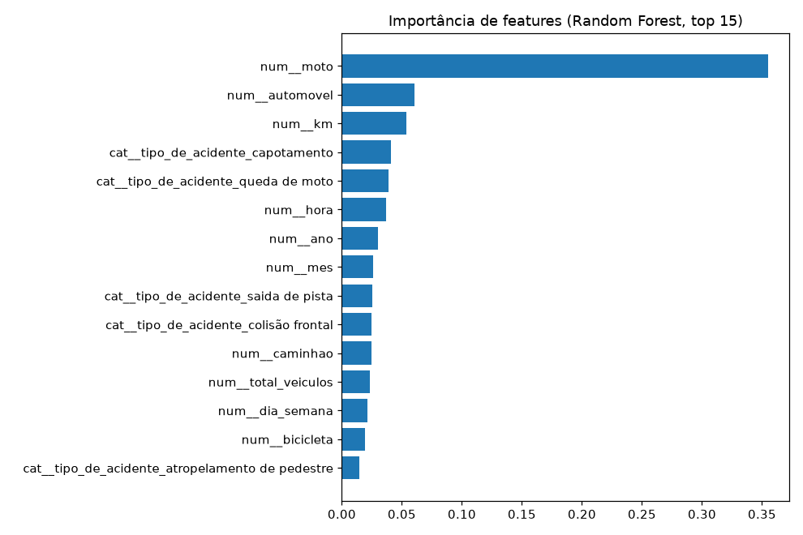

# 02 — Fase 0: baseline de classificação de severidade

> Incremento 2 da Fase 0. Ingestão consolidada + baseline supervisionado.
> Artefatos: [reports/fase0_baseline/](../reports/fase0_baseline/) (métricas + figuras).

## Problema

Prever se um acidente **teve vítima** (`houve_vitima`) a partir de condições
conhecidas no local — hora, km, tipo de acidente, veículos envolvidos,
concessionária, UF. Dado: 1.031.088 acidentes (37 concessionárias, 2010–2026).

## Decisões e por quê

- **Alvo derivado das contagens numéricas de vítimas**, não do rótulo textual
  `tipo_de_ocorrencia` (inconsistente entre fontes: `sem vítima`, `3 - Aciden…`,
  `ac03 - aci…`). Prevalência: 35,9% com vítima, 2,12% fatal.
- **Sem leakage:** as colunas de vítimas e o rótulo textual definem o alvo →
  excluídas das features (fixado em `COLUNAS_PROIBIDAS`, garantido por teste).
- **Métricas para dado desbalanceado:** acurácia engana; reportamos ROC-AUC,
  PR-AUC, F1, balanced accuracy, com `class_weight='balanced'` em todos.
- **Normalização de categóricas:** caixa/espaços normalizados (`Colisão Traseira`
  = `colisão traseira`); one-hot com corte de raras (`min_frequency`) para não
  explodir a dimensionalidade de `tipo_de_acidente`.
- **Validação:** holdout estratificado 80/20 + CV 5-fold de ROC-AUC (em subamostra
  de 150k por tratabilidade — declarado, não silencioso).

## Resultados (conjunto de teste, 206.218 acidentes)

| Modelo | ROC-AUC | PR-AUC | F1 | Bal.Acc | CV ROC-AUC |
|---|---|---|---|---|---|
| **hist_gradient_boosting** ⭐ | 0.813 | 0.736 | 0.672 | 0.744 | 0.810 ± 0.002 |
| random_forest | 0.813 | 0.735 | 0.668 | 0.743 | 0.808 ± 0.002 |
| regressao_logistica | 0.791 | 0.698 | 0.654 | 0.731 | 0.791 ± 0.002 |
| arvore_decisao | 0.782 | 0.688 | 0.657 | 0.735 | 0.769 ± 0.002 |

Os **ensembles** (boosting/bagging) superam o modelo linear e a árvore única, como
esperado. Desvio de CV baixíssimo (±0,002) → estimativa estável. Sinal honesto:
nem trivial (≠ 1,0), nem aleatório (≠ 0,5).

## Interpretação (importância de features, Random Forest)

O sinal dominante é **envolvimento de moto** (~0,35), seguido de automóvel, km,
`capotamento`, `queda de moto` e hora. Faz sentido de domínio: motos, atropelamentos
e capotamentos elevam a severidade. O modelo aprendeu física do trânsito, não ruído.



## Reproduzir

```bash
python -m rodoia.ingestao.baixar_acidentes        # baixa CSVs (DVC)
python -m rodoia.ingestao.ingestao_acidentes      # -> data/processed/acidentes.parquet
python -m rodoia.ml.classico                  # treina, avalia, gera reports/
```

## Próximo incremento

Diagnóstico aprofundado (curvas de aprendizado, bias/variance, calibração) +
clustering exploratório; depois a MLP em PyTorch com backprop manual e o bloco de
atenção — os itens que fecham a lacuna de DL fundamental.
