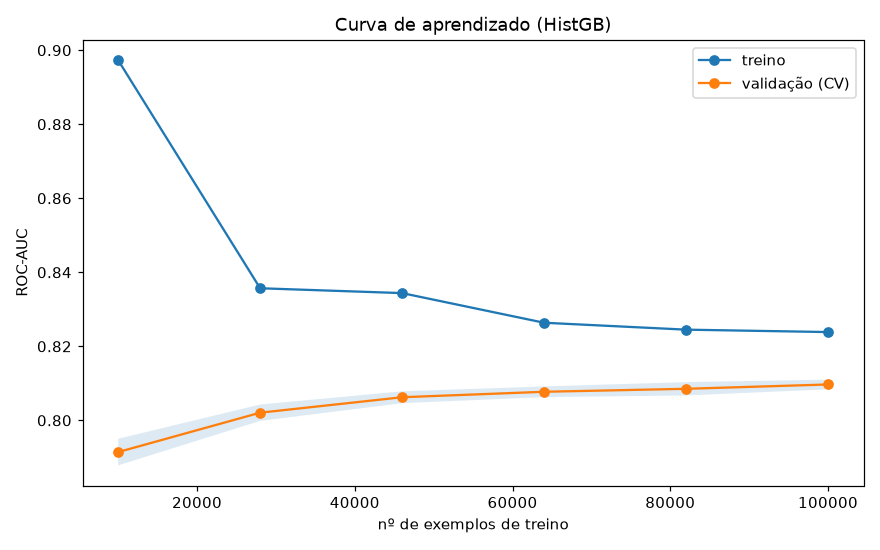
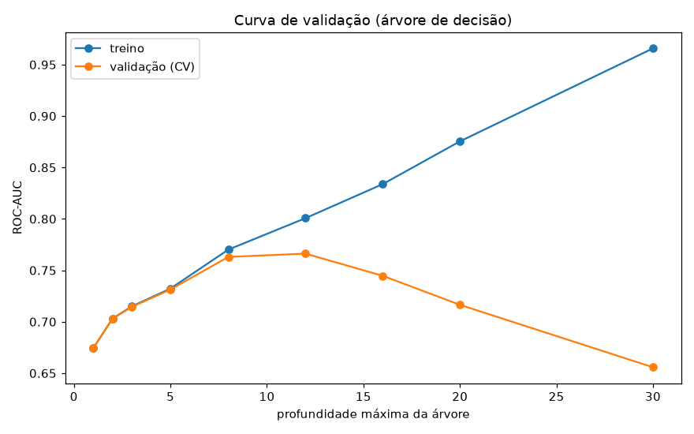
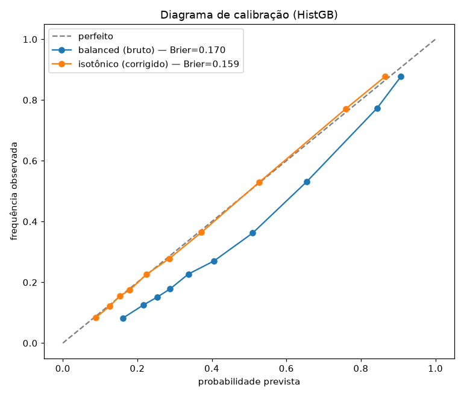

# 03 — Fase 0: diagnóstico do modelo

> Incremento 3 da Fase 0 (item "diagnóstico"). Roda numa subamostra de 150k
> (declarada) para custo tratável. Artefatos: [reports/fase0_diagnostico/](../reports/fase0_diagnostico/).
> Reproduzir: `python -m rodoia.ml.diagnostico`.

## 1. Curva de aprendizado → bias vs. variância

Score de treino e de validação conforme cresce o volume de dados:

- Treino final: **0,824** · Validação final: **0,810** · **Fenda: 0,014**.

**Leitura:** a fenda é pequena → **variância baixa** (o modelo não decorou o treino).
As duas curvas estabilizam em ~0,81 → o modelo está perto do seu **limite de bias**:
mais dados quase não melhoram. Para subir daqui, o caminho é **melhores features**
(ex.: clima, tipo de pista, curva/reta), não mais linhas. Diagnóstico honesto de
um modelo bem generalizado, porém limitado pela informação disponível.

## 2. Curva de validação → o mecanismo do overfitting

Variando a profundidade de uma árvore de decisão:

- Profundidade **ótima ≈ 12** (validação = 0,766).
- Na profundidade 30: **treino = 0,966, validação = 0,656**.

**Leitura:** é o retrato clássico do overfitting — quando a árvore fica muito
profunda, ela memoriza o treino (score sobe) mas **generaliza cada vez pior**
(validação despenca). Justifica numericamente por que limitamos a profundidade
no baseline.

## 3. Calibração → as probabilidades são confiáveis?

Um classificador não deve só ordenar bem (ROC-AUC), deve também cuspir
**probabilidades honestas** (se diz "70%", que aconteça ~70% das vezes).

- Brier (balanced, bruto): **0,170** → Brier (isotônico): **0,159** (menor é melhor).

**Leitura:** `class_weight='balanced'` melhora o *ranking* mas **distorce as
probabilidades** (infla a classe rara). A **calibração isotônica** corrige isso e
reduz o Brier. Lição de produção: escolher a métrica certa para o objetivo —
ranking vs. probabilidade calibrada são coisas diferentes.

## 4. Clustering (KMeans) → arquétipos de acidente (não supervisionado)

Agrupamento das features numéricas padronizadas (k escolhido por silhueta: k=6,
silhueta ~0,17 — modesta, honesta: acidente não forma grupos cristalinos).

| Cluster | n | Taxa de vítima | Moto (média) | Perfil |
|---|---|---|---|---|
| 0 | 24.625 | **80,0%** | 1,06 | **Acidente com moto** — de longe o mais grave |
| 5 | 3.911 | 38,5% | 0,12 | Múltiplos veículos |
| 1 | 11.770 | 35,5% | 0,16 | Múltiplos veículos |
| 3 | 41.809 | 26,9% | 0,00 | Só veículos, sem moto |
| 4 | 67.702 | 25,1% | 0,00 | Só veículos, menos denso |

**Leitura (o achado mais bonito):** o clustering **não supervisionado** — que nunca
viu o alvo — separou espontaneamente o "arquétipo moto" com **80% de severidade**,
o triplo dos acidentes sem moto. Isso **corrobora de forma independente** a
importância de features do modelo supervisionado (onde `moto` também dominou).
Dois métodos distintos apontando o mesmo sinal físico = confiança no resultado.

## Conclusão da análise

O modelo é honesto e bem generalizado (variância baixa), limitado por bias/feature,
com overfitting bem compreendido e controlado, probabilidades calibráveis, e um
sinal de domínio (moto → gravidade) confirmado por dois caminhos. Fecha o item de
ML clássico da Fase 0.
