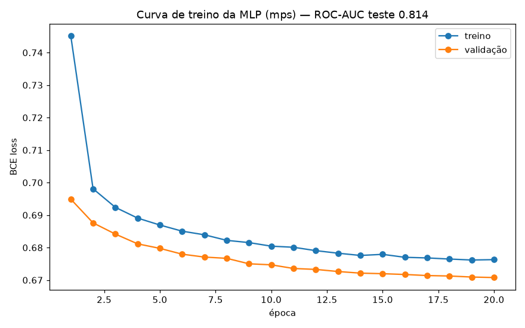

# 04 — Fase 0: rede neural e backpropagation

> Incremento 4 da Fase 0 — os itens de **Deep Learning fundamental**. Duas peças:
> (A) backprop implementada à mão em NumPy e provada correta; (B) uma MLP em
> PyTorch treinada no problema real, na GPU do Mac.

## Parte A — Backpropagation à mão (`fundamentos/backprop_numpy.py`)

Uma rede de 2 camadas escrita em NumPy puro, com os gradientes derivados na mão:

```
X ──(W1,b1)──> z1 ──ReLU──> a1 ──(W2,b2)──> z2 ──sigmoid──> p
```

### A matemática (o que se defende em entrevista)

A perda é **binary cross-entropy** (BCE). Ela não é arbitrária: é a
**log-verossimilhança negativa** de uma distribuição de Bernoulli — a escolha
natural quando o alvo é 0/1. Para a saída, sigmoid + BCE têm uma propriedade
elegante: a derivada da perda em relação ao **logit** `z2` colapsa para

```
∂L/∂z2 = (p − y) / N
```

"erro previsto menos real" — limpo, sem termos da derivada da sigmoid sobrando. É
por isso que sigmoid+BCE (e softmax+cross-entropy) são o par padrão. A partir daí,
a **regra da cadeia** propaga o gradiente para trás, camada a camada:

| Gradiente | Fórmula | Intuição |
|---|---|---|
| `dW2` | `a1ᵀ · dz2` | quanto cada peso da saída contribuiu para o erro |
| `da1` | `dz2 · W2ᵀ` | erro "devolvido" à camada oculta |
| `dz1` | `da1 ⊙ (z1>0)` | passa pelo gate da ReLU (1 se ativo, 0 se não) |
| `dW1` | `Xᵀ · dz1` | idem para a 1ª camada |

### A prova de que está certo

Duas verificações independentes, ambas em teste automatizado:

1. **Gradient checking** — compara o gradiente analítico com o **numérico** por
   diferenças finitas `(L(θ+ε) − L(θ−ε)) / 2ε`. Erro relativo **< 1e-6** (zero, na
   prática). Se a derivação estivesse errada, falharia.
2. **Equivalência com PyTorch** — os mesmos pesos no autograd do framework
   produzem gradientes idênticos aos nossos (`atol=1e-8`).

> É o teste que um framework **não** faz por você: prova que eu entendo a
> matemática, não só que sei chamar `.backward()`.

## Parte B — MLP em PyTorch (`ml/mlp_torch.py`)

Rede `Linear→ReLU→Dropout→Linear→ReLU→Dropout→Linear(logit)` (92 features de
entrada após o pré-processamento), treinada com **laço de otimização explícito**:

```python
otimizador.zero_grad()   # zera gradientes anteriores
logits = modelo(xb)      # forward
perda  = criterio(...)   # BCEWithLogitsLoss (com pos_weight p/ desbalanceamento)
perda.backward()         # autograd calcula os gradientes
otimizador.step()        # Adam atualiza os pesos
```

Rodou na **GPU Metal (MPS)** do Mac M3 Pro. `pos_weight` no lugar do
`class_weight` do sklearn trata o desbalanceamento.

### Resultado

| Modelo | ROC-AUC (teste) | Observação |
|---|---|---|
| **MLP (PyTorch, MPS)** | **0,814** | 20 épocas, ~16 s |
| HistGradientBoosting (baseline) | 0,813 | melhor modelo clássico |

A rede neural **empata com o melhor modelo clássico** — e a curva de treino mostra
`treino ≈ validação` (0,676 vs 0,671), ou seja, **sem overfitting**. Em dado
tabular, é o esperado: árvores/boosting e MLP costumam ficar lado a lado; o valor
aqui é **provar domínio do PyTorch e do ciclo de treino**, não vencer o baseline.



## O que estes dois itens provam

- Entendo backpropagation no nível da **matemática** (derivei e provei), não só da API.
- Sei construir e treinar uma rede em **PyTorch** com laço manual, em **GPU**,
  tratando desbalanceamento e medindo generalização.

Fecha os itens 3 e 4-parcial da Fase 0. Falta o **bloco de atenção** (self-attention
à mão) e o **notebook de matemática aplicada** para a fase ficar 100%.
