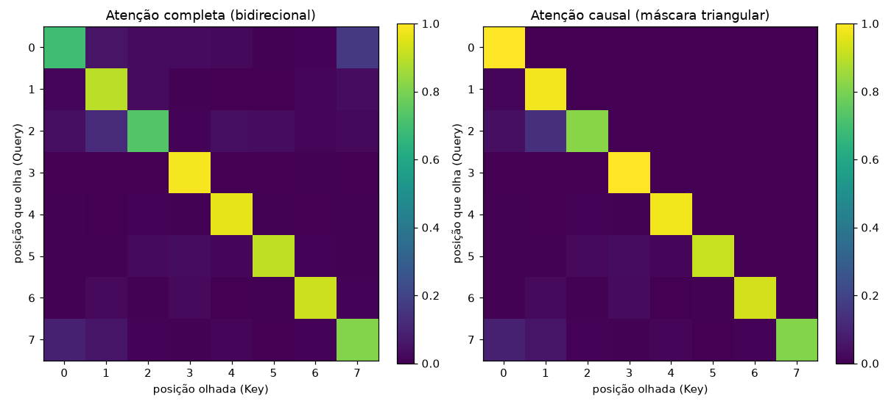

# 05 — Fase 0: self-attention à mão (o coração do Transformer)

> Incremento 5 da Fase 0. Implementação de `fundamentos/attention.py`, provada
> equivalente à referência do PyTorch. É a base teórica das Fases 1–4 (todo LLM
> é uma pilha de blocos de atenção).

## O que é atenção

Cada elemento de uma sequência gera três vetores:

- **Query (Q)** — "o que eu procuro";
- **Key (K)** — "o que eu ofereço";
- **Value (V)** — "o que eu entrego se for escolhido".

A atenção compara cada Query com todas as Keys (produto interno = similaridade),
transforma as similaridades em pesos que somam 1 (softmax) e devolve a **soma
ponderada dos Values**:

```
Attention(Q, K, V) = softmax( Q·Kᵀ / √d_k ) · V
```

**Por que dividir por √d_k?** Sem isso, os produtos internos crescem com a dimensão,
empurram o softmax para regiões saturadas e o **gradiente vai a zero** (a rede para
de aprender). O fator de escala mantém a variância controlada — detalhe pequeno,
efeito grande.

## O que implementei (PyTorch puro, sem `nn.MultiheadAttention`)

- `scaled_dot_product_attention(q, k, v, mascara)` — a fórmula acima, do zero.
- `mascara_causal(n)` — máscara triangular: a posição i só vê i e anteriores.
- `AutoAtencao` — self-attention de 1 cabeça (projeta X em Q/K/V e aplica).
- `AtencaoMultiCabeca` — várias atenções em paralelo, cada uma num subespaço,
  concatenadas e projetadas (deixa o modelo captar vários tipos de relação).

## A prova (equivalência com a referência)

Testes automatizados confirmam que a implementação bate, **numericamente**, com
`torch.nn.functional.scaled_dot_product_attention` do PyTorch:

- sem máscara: igual com `atol=1e-9` (praticamente exato);
- com máscara causal: igual ao `is_causal=True` do framework;
- os pesos de cada linha somam 1 (é uma distribuição);
- a máscara causal zera de fato tudo acima da diagonal.

> É a prova pedida pelo escopo: não basta *usar* atenção, é implementá-la e mostrar
> que a matemática está correta contra a referência.

## Visualização

A matriz de atenção é literalmente "quem olha para quem". À esquerda, atenção
bidirecional (cada posição pode olhar todas); à direita, causal (triangular —
o padrão dos LLMs geradores de texto).



## Por que isso importa para o resto do projeto

Todo LLM que vamos usar nas Fases 1 (RAG), 2 (fine-tuning) e 4 (agente) é uma
pilha desses blocos. Ter implementado a atenção do zero — e provado correta —
significa que, numa entrevista, consigo explicar **como um Transformer presta
atenção ao contexto**, não só que sei chamar a API. Fecha o item de arquitetura
de redes da Fase 0.
